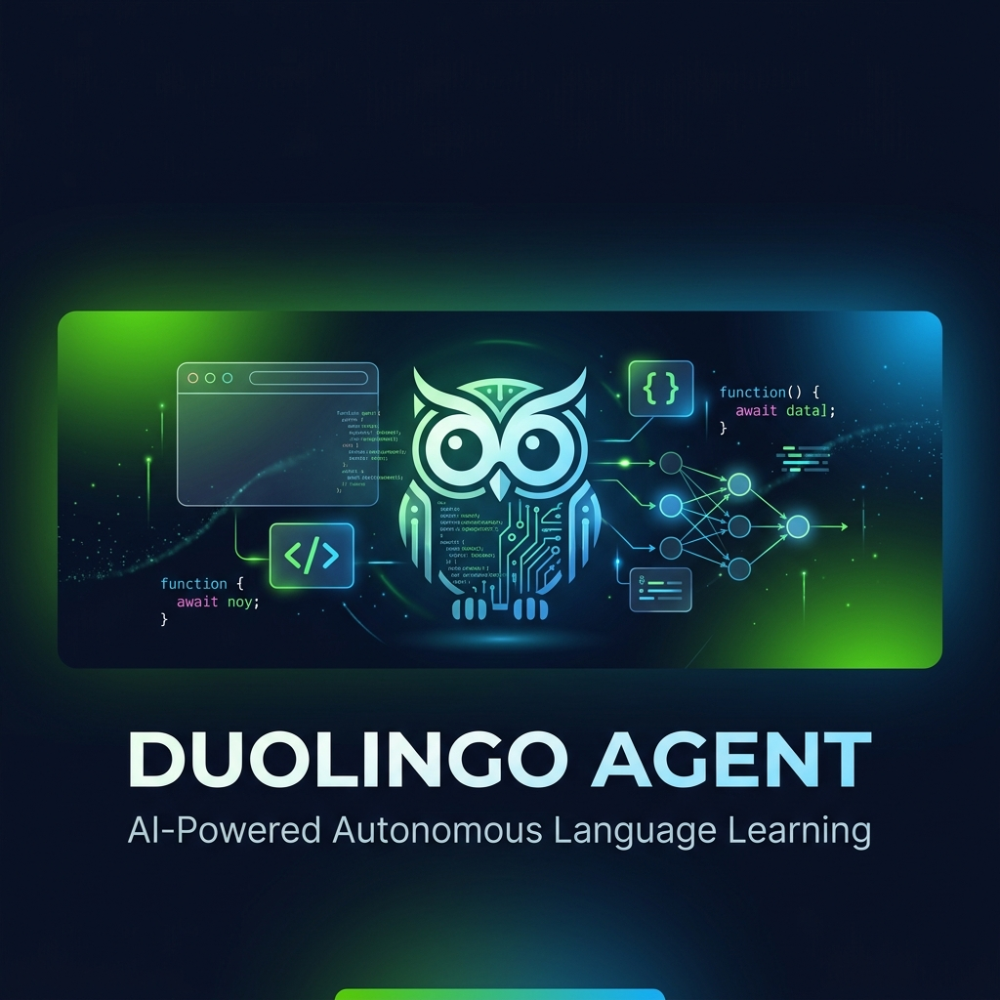
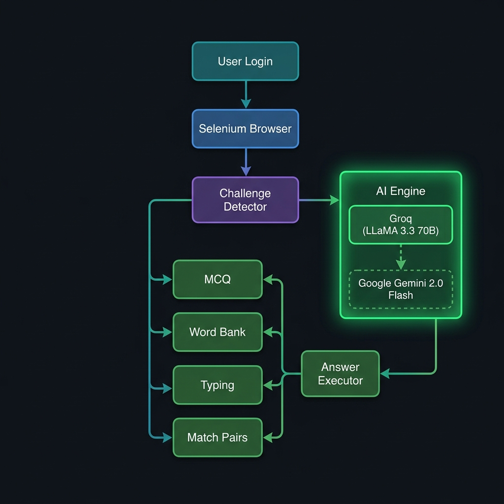
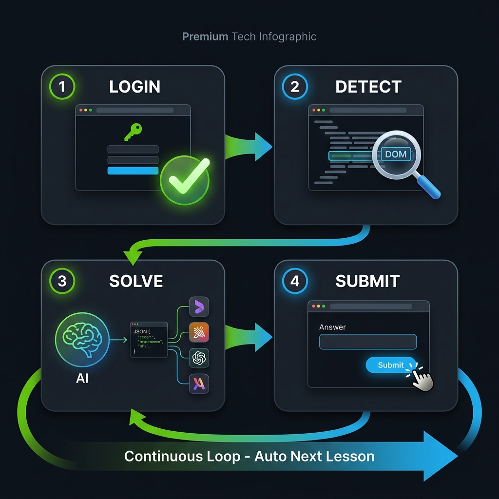

<div align="center">



<br/>
<br/>

[](https://python.org)
[](https://selenium.dev)
[](https://groq.com)
[](https://ai.google.dev)
[](LICENSE)
[](https://github.com/swarajshelke12/Duolingo-agent)
[](https://github.com/swarajshelke12/Duolingo-agent/commits)
[](https://github.com/swarajshelke12/Duolingo-agent)

**A fully autonomous AI agent that completes Duolingo lessons — zero human intervention required.**

[Getting Started](#-getting-started) | [How It Works](#-how-it-works) | [Architecture](#-architecture) | [Configuration](#%EF%B8%8F-configuration) | [Contributing](#-contributing)

</div>

---

## 🌟 Overview

Duolingo Agent is an autonomous browser automation system powered by a dual-LLM architecture. It logs into your Duolingo account, detects every type of language challenge in real time, solves them using AI, and submits answers — then automatically moves on to the next lesson. Continuously. Without you touching anything.

The v2 architecture is built as a modular Python package with a state machine orchestrator, 4-tier AI solving (cache, Groq, Gemini text, Gemini Vision), correction learning, and robust anti-detection.

---

## ✨ Features

<table>
<tr>
<td width="50%">

### 🧠 Dual-AI Solver with Vision Fallback
Groq LLaMA 3.3 70B solves challenges at blazing speed. If rate-limited, Gemini 2.0 Flash takes over. If DOM scraping fails entirely, Gemini Vision analyzes a screenshot of the page and solves it visually.

</td>
<td width="50%">

### 🎯 Every Challenge Type Handled
MCQ, word bank, typing, match pairs, fill-in-the-blank, tap-to-complete, character select, listening (skip or solve), and speaking (auto-skip). If Duolingo adds a new type, the vision fallback catches it.

</td>
</tr>
<tr>
<td width="50%">

### 📚 Correction Learning
When the agent gets an answer wrong, it reads Duolingo's green correction banner, stores the correct answer in a local cache, and never makes the same mistake twice.

</td>
<td width="50%">

### 🔄 Continuous Autonomous Operation
After completing a lesson, the agent automatically navigates back, finds the next lesson, and starts it. Set `--max-lessons 10` or let it run indefinitely.

</td>
</tr>
<tr>
<td width="50%">

### ⚙️ State Machine Architecture
Eight clearly defined states (LOGIN, NAVIGATE, LESSON_START, CHALLENGE, SUBMIT, FEEDBACK, LESSON_END, DONE) with stuck detection, auto-recovery, and graceful error handling.

</td>
<td width="50%">

### 🛡️ Anti-Detection Stealth
CDP-injected JavaScript removes `navigator.webdriver`, spoofs plugins and languages, disables automation flags, and uses a persistent Chrome profile for natural session cookies.

</td>
</tr>
</table>

---

## 🏗️ Architecture

<div align="center">

</div>

<br/>

The system is built as **7 specialized modules**:

| Module | File | Responsibility |
|---|---|---|
| ⚙️ Config | `duolingo_agent/config.py` | Environment loading, API key validation, timing constants |
| 🎨 Logger | `duolingo_agent/logger.py` | Rich colored console output with ASCII art, emojis, and dashboards |
| 🌐 Browser | `duolingo_agent/browser.py` | Chrome setup, anti-detection, safe click/type, screenshots |
| 🔍 Parser | `duolingo_agent/challenges.py` | DOM scraping, challenge type detection, correction extraction |
| 🧠 Solver | `duolingo_agent/solver.py` | Dual-AI solving, vision fallback, correction cache |
| ▶️ Executor | `duolingo_agent/executor.py` | Answer submission engine with confidence matching |
| 🤖 Agent | `duolingo_agent/agent.py` | State machine orchestrator with lifecycle feedback |

### 🔗 Solving Pipeline

```
⚡ Cache Lookup ──▶ 🧠 Groq LLaMA 3.3 70B ──▶ ✨ Gemini 2.0 Flash (text) ──▶ 👁 Gemini 2.0 Flash (vision)
```

Each tier only activates if the previous one fails. The cache makes repeated challenges instant (zero API calls).

---

## 🚀 How It Works

<div align="center">

</div>

<br/>

**Step 1 — 🔑 Login.**
Opens Duolingo and waits for manual login (first time only). Session is persisted in `chrome_profile/` so subsequent runs are automatic.

**Step 2 — 🔍 Detect.**
The challenge parser scans `data-test` attributes to identify 25+ challenge type variants and extracts headers, prompts, options, tiles, and tokens from the DOM.

**Step 3 — 🧠 Solve.**
Challenge data is formatted into a type-specific prompt (MCQ, word bank, typing, match, fill-blank) and sent to the AI. Responses are structured JSON: `{"answer": <value>}`.

**Step 4 — ▶️ Submit.**
The executor maps answers back to DOM elements using JavaScript injection. For typing, it clears and fills the input. For MCQ, it uses 3-pass matching (exact, substring, word overlap). Then it clicks Check and processes feedback.

**After each lesson**, the agent clicks through XP summaries and modals, navigates back, and auto-starts the next lesson.

---

## 📋 Console Preview

When running, the agent produces rich, color-coded terminal output:

```
  ╭────────────────────────────────────────────────────────────────────────╮
  │              ,___,                                                    │
  │              [O.o]                                                    │
  │              /)__)                                                    │
  │              -"--"-                                                   │
  │                                                                      │
  │  ██████╗ ██╗   ██╗ ██████╗ ██╗     ██╗███╗  ██╗ ██████╗  ██████╗    │
  │  ██╔══██╗██║   ██║██╔═══██╗██║     ██║████╗ ██║██╔════╝ ██╔═══██╗   │
  │  ██║  ██║██║   ██║██║   ██║██║     ██║██╔██╗██║██║  ███╗██║   ██║   │
  │  ██║  ██║██║   ██║██║   ██║██║     ██║██║╚████║██║   ██║██║   ██║   │
  │  ██████╔╝╚██████╔╝╚██████╔╝███████╗██║██║ ╚███║╚██████╔╝╚██████╔╝  │
  │  ╚═════╝  ╚═════╝  ╚═════╝ ╚══════╝╚═╝╚═╝  ╚══╝ ╚═════╝  ╚═════╝ │
  │                                                                      │
  │  ⚡ AI-Powered Autonomous Language Learning Agent                     │
  │  v2.0.0 │ 🦉 Duolingo Agent │ 🚀 Ready to learn                     │
  ╰────────────────────────────────────────────────────────────────────────╯

  11:30:42  INFO  ℹ Checking login status...
  11:30:45   ✓   ✓ Logged in! Session restored from Chrome profile.

  ╭────────────────────────────────────────────────────╮
  │  🦉  LESSON 1                                     │
  │  Started at 11:30:46                               │
  ╰────────────────────────────────────────────────────╯

  11:30:47   🎯   #1 [MCQ] Q: Select the correct translation
  11:30:47   AI   🧠 Groq LLaMA 3.3 (342ms)
  11:30:47   ◀◀   ⚡ Answer: la casa
  11:30:48   ──   ✓✓ Selected (exact match): la casa

  ✨✨✨  LESSON 1 COMPLETE!  ✨✨✨
     🏆 8 challenges solved in 45s  🎉
```

---

## 📦 Getting Started

### Prerequisites

- **Python 3.8+**
- **Google Chrome** browser
- At least one API key:
  - [Groq API Key](https://console.groq.com/keys) — primary, fast, free tier
  - [Google Gemini API Key](https://aistudio.google.com/apikey) — fallback + vision

### Installation

```bash
# Clone
git clone https://github.com/swarajshelke12/Duolingo-agent.git
cd Duolingo-agent

# Virtual environment
python -m venv .venv
.venv\Scripts\activate          # Windows
# source .venv/bin/activate     # macOS/Linux

# Install dependencies
pip install -r requirements.txt
```

### 🔑 Configure API Keys

```bash
# Copy the template
cp .env.example .env

# Edit .env and add your keys
```

```env
GROQ_API_KEY=your_groq_api_key_here
GEMINI_API_KEY=your_gemini_api_key_here
```

### ▶️ Run

```bash
# Standard mode — infinite lessons, fully autonomous
python main.py

# Run 5 lessons then stop
python main.py --max-lessons 5

# Headless mode (no visible browser)
python main.py --headless

# Wait for user input between lessons
python main.py --no-auto-continue

# All options
python main.py --help
```

---

## ⚙️ Configuration

### CLI Arguments

| Flag | Default | Description |
|---|---|---|
| `--headless` | off | Run Chrome without a visible window |
| `--max-lessons N` | 0 (infinite) | Stop after N lessons |
| `--no-auto-continue` | off | Wait for ENTER between lessons |
| `--browser-path PATH` | auto | Custom Chrome/Chromium binary path |
| `--quiet` | off | Suppress debug log messages |

### Environment Variables

| Variable | Required | Description |
|---|---|---|
| `GROQ_API_KEY` | One of two | Groq API key (primary AI) |
| `GEMINI_API_KEY` | One of two | Google Gemini API key (fallback + vision) |

---

## 📁 Project Structure

```
Duolingo-agent/
│
├── duolingo_agent/                 # Core package
│   ├── __init__.py                 # Package exports
│   ├── config.py                   # Configuration & env loading
│   ├── logger.py                   # Rich colored console logging
│   ├── browser.py                  # Chrome + anti-detection
│   ├── challenges.py               # DOM parser & challenge detection
│   ├── solver.py                   # Dual-AI solver + vision + cache
│   ├── executor.py                 # Answer submission engine
│   └── agent.py                    # State machine orchestrator
│
├── main.py                         # CLI entry point
├── requirements.txt                # Python dependencies
├── .env.example                    # API key template
├── .env                            # Your API keys (git-ignored)
├── .gitignore                      # Git exclusions
├── chrome_profile/                 # Persistent session (auto-generated)
├── correction_cache.json           # Learned corrections (auto-generated)
├── assets/                         # README visuals
└── README.md                       # This file
```

---

## 🎯 Challenge Types

| Type | Detection | Solving Method |
|---|---|---|
| ✅ Multiple Choice | `challenge-choice`, `role="radio"` | AI selects option, 3-pass matching |
| 🔤 Word Bank | `challenge-tap-token` (outside match) | AI orders tiles, sequential tapping |
| ⌨️ Typing / Translation | `challenge-translate-input` textarea | AI translates, types into field |
| 🔗 Match Pairs | `challenge-match` context | AI pairs tokens, clicks in sequence |
| 📝 Fill in the Blank | `completeReverseTranslation` | AI fills missing word |
| 👆 Tap to Complete | `tapComplete` | AI selects completion token |
| 👂 Listening | `challenge-listen` | Auto-skip or solve if typing input present |
| 🗣️ Speaking | `challenge-speak` | Auto-skip via "Can't speak now" |
| 🔠 Character Select | `characterSelect` | AI selects correct character |

---

## 🔧 Troubleshooting

| Problem | Solution |
|---|---|
| `ModuleNotFoundError` | Run `pip install -r requirements.txt` inside your virtual environment |
| `ChromeDriver version mismatch` | Update Chrome. `webdriver-manager` auto-downloads the correct driver. |
| `Rate limit (429)` | The agent auto-pauses and retries. Add both API keys for failover. |
| `Browser disconnected` | Agent detects this and exits gracefully. Restart with `python main.py`. |
| `Can't start lesson automatically` | Click the lesson manually. The agent detects the URL change and takes over. |
| `Wrong answers` | The correction cache (`correction_cache.json`) learns from mistakes over time. |

---

## ⚠️ Disclaimer

> This project is for **educational and research purposes only**. It demonstrates browser automation combined with large language model integration. Use responsibly and in accordance with Duolingo's Terms of Service. The authors are not responsible for any consequences arising from usage of this software.

---

## 🤝 Contributing

Contributions are welcome!

1. Fork the repository
2. Create a feature branch: `git checkout -b feature/your-feature`
3. Commit your changes: `git commit -m "Add your feature"`
4. Push to the branch: `git push origin feature/your-feature`
5. Open a Pull Request

---

## 📄 License

This project is open source. See the [LICENSE](LICENSE) file for details.

---

<div align="center">

**Built with ❤️ and ☕ by [swarajshelke12](https://github.com/swarajshelke12)**

[](https://github.com/swarajshelke12)

<br/>

⭐ **If this project helped you, consider giving it a star!** ⭐

</div>